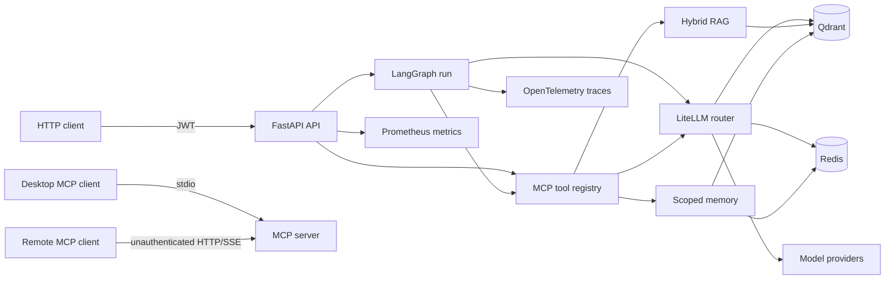
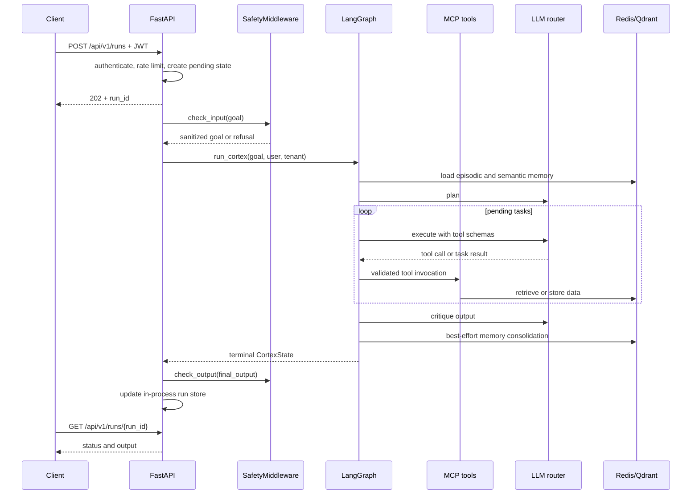
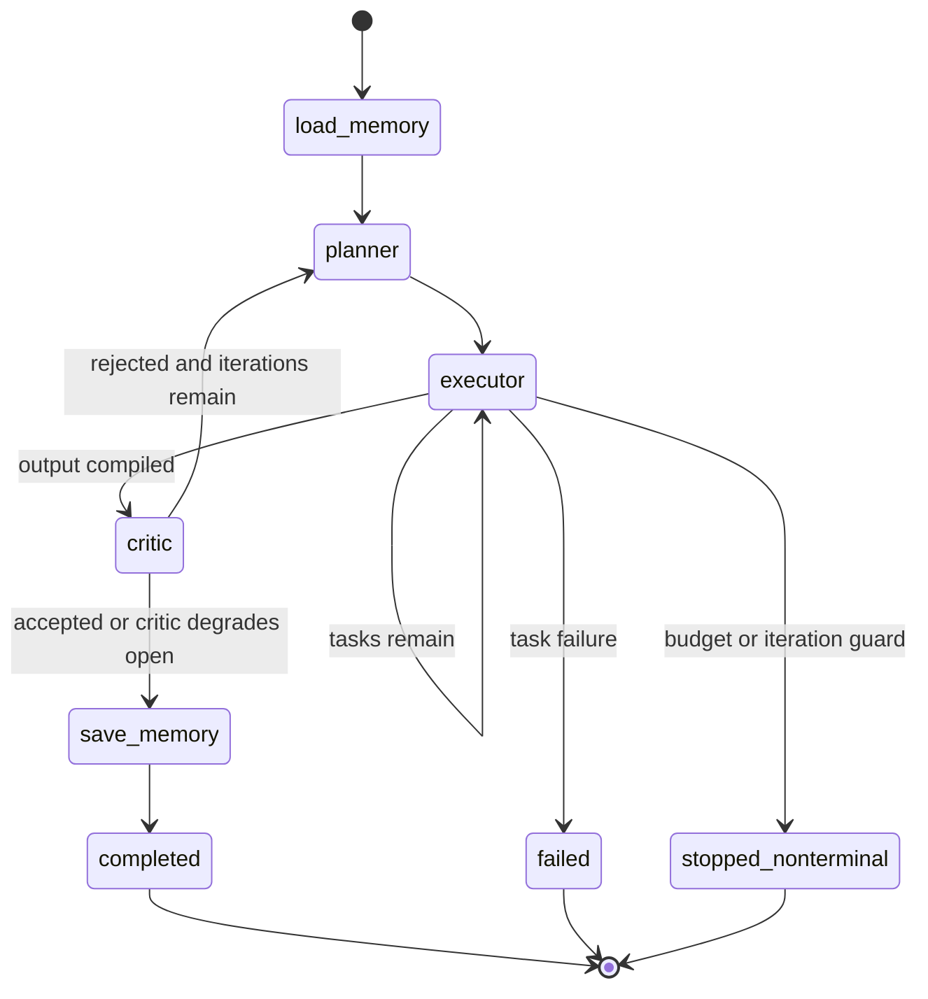
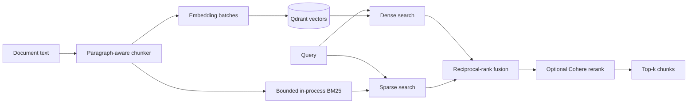
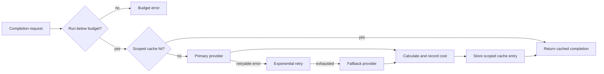

# Architecture

This document is the canonical description of Cortex's system and AI design.
It describes the implementation on `main`, not a target architecture. Runtime
gaps are kept in [Limitations and roadmap](LIMITATIONS.md), operational
procedures in [Operations](OPERATIONS.md), and security analysis in the
[Threat model](THREAT_MODEL.md).

## System context

The HTTP API is the only repository-provided network entry point that combines
authentication with per-caller principal binding. The standalone MCP server
supports stdio, HTTP, and SSE, but its network transports do not authenticate
callers. See [Trust boundaries](THREAT_MODEL.md#trust-boundaries).

Primary implementation:
[`api/main.py`](../src/cortex/api/main.py),
[`graph/cortex_graph.py`](../src/cortex/graph/cortex_graph.py),
[`mcp/server.py`](../src/cortex/mcp/server.py), and
[`llm/router.py`](../src/cortex/llm/router.py).

## HTTP request and run flow

`POST /api/v1/runs` schedules a FastAPI background task and returns a run ID.
The run store is bounded but process-local. SSE is a polling adapter over that
store rather than a push channel from graph nodes. The implementation is in
[`api/main.py`](../src/cortex/api/main.py), with behavior covered by
[`tests/test_api`](../tests/test_api) and run-store cases in
[`test_runstore.py`](../tests/test_api/test_runstore.py).

Input and output safety checks wrap HTTP-created runs. Direct Python calls to
`run_cortex()` do not pass through `SafetyMiddleware`; library callers own that
boundary.

The graph-level budget/iteration branch currently ends without updating an
`executing` state to `failed`. Callers can therefore observe a nonterminal
status after graph execution. The LLM router still refuses provider calls when
the Redis run ledger reaches `MAX_COST_PER_RUN_USD`; the graph status defect is
tracked in [Limitations](LIMITATIONS.md#budget-and-iteration-exits-can-remain-nonterminal).

## Agent graph and state

[`CortexState`](../src/cortex/graph/state.py) is a Pydantic model containing
the request identity, goal, task list, completed results, critique history,
iteration and cost counters, final output, and run status. Routing functions
in [`cortex_graph.py`](../src/cortex/graph/cortex_graph.py) decide the next node
from this explicit state.

The graph uses LangGraph's in-memory checkpointer. When
`HUMAN_REVIEW_BEFORE_CRITIC=true`, it interrupts before the critic and returns
`awaiting_human`; no API resumes that checkpoint. The flag is off by default.

### Agent responsibilities

| Node | Responsibility | Failure behavior |
|---|---|---|
| Memory loader | Retrieve recent episodes and semantically related facts | Store failures degrade to empty context |
| Planner | Produce a bounded JSON task plan | Invalid plans fail the run |
| Executor | Bind tools to the model and perform up to three tool rounds per task | Tool errors are returned to the model; unresolved tasks fail |
| Critic | Score faithfulness, completeness, coherence, and overall quality; request replanning | Critic errors accept with a low-confidence score rather than discarding a completed answer |
| Memory saver | Persist a run episode and heuristic facts | Failures are logged and do not erase the answer |

Implementations and tests:
[`agents`](../src/cortex/agents),
[`test_agents`](../tests/test_agents), and
[`test_graph`](../tests/test_graph).

## Tool layer and MCP

The registry in [`mcp/catalog.py`](../src/cortex/mcp/catalog.py) defines the
tool names used by configuration and discovery. Implementations live in
[`mcp/server.py`](../src/cortex/mcp/server.py):

| Tool | Backing behavior | Principal requirements |
|---|---|---|
| `search_knowledge` | Hybrid RAG retrieval | Search filters are supplied by the call |
| `query_memory` | Episodic and/or semantic memory retrieval | Requires a bound user and tenant |
| `query_data` | Read-only SQL path supported by the tool implementation | Database target and query constraints are validated by the tool |
| `synthesise` | LLM-backed transformation | Uses the configured LLM router |
| `execute_code` | Python subprocess with timeout and returned-output truncation | Disabled by default; no sandbox boundary |

The in-process client in [`mcp/client.py`](../src/cortex/mcp/client.py)
validates arguments against the callable signature before invocation. HTTP
calls through `POST /api/v1/mcp/call` are restricted to
`MCP_HTTP_TOOL_ALLOWLIST` and bind the JWT principal. Stdio can declare a
single process identity; standalone HTTP/SSE cannot safely derive one and
memory access refuses without it.

Coverage:
[`tests/test_mcp`](../tests/test_mcp), including principal binding and
`query_data` cases.

## Retrieval-augmented generation

[`rag/pipeline.py`](../src/cortex/rag/pipeline.py) provides:

- paragraph-aware chunking with configurable word count and overlap;
- content-addressed document identifiers for idempotent upserts;
- batched embeddings and Qdrant storage;
- dense and sparse retrieval with filters applied to both paths;
- reciprocal-rank fusion; and
- optional Cohere reranking, with fused results returned when no key exists.

The sparse index is process-local and bounded by `RAG_MAX_INDEXED_CHUNKS`.
Supplied filters are applied to dense and sparse paths, but the HTTP ingestion
path stores `ingested_by` rather than a tenant ID and `search_knowledge` does
not derive a filter from the bound principal. The shipped RAG corpus is
therefore shared across tenants. Tests live in
[`tests/test_rag`](../tests/test_rag).

## Memory model

| Tier | Store | Scope and lifetime | Purpose |
|---|---|---|---|
| Working | Process memory | Defined helper, not graph-integrated | Intended token-budgeted prompt context |
| Episodic | Redis sorted sets | Tenant + user; TTL | Recent run summaries |
| Semantic | Qdrant | Tenant + user; no repository-defined expiry | Retrieved facts extracted from task results |

The graph loads episodic and semantic memory concurrently before planning.
Consolidation stores a summary and up to five heuristic facts after a
successful run. Fact extraction is not an LLM-backed knowledge distillation
pipeline; it uses task descriptions and truncated results.

`WorkingMemory` is implemented and unit tested, but no runtime graph node
instantiates it or uses its token budget when constructing planner/executor
prompts. It must not be treated as an active context-window control.

Implementation and tests:
[`memory_agent.py`](../src/cortex/agents/memory_agent.py) and
[`tests/test_memory`](../tests/test_memory).

## LLM routing, cache, and cost

[`llm/router.py`](../src/cortex/llm/router.py) is the single completion
interface. Before a provider call, it checks the Redis cost ledger against
`MAX_COST_PER_RUN_USD`. A successful response is costed through LiteLLM and
recorded by [`cost_tracker.py`](../src/cortex/llm/cost_tracker.py).

[`llm/cache.py`](../src/cortex/llm/cache.py) embeds prompt text, stores only a
digest with the response payload, and filters by model and caller-provided
scope. An unscoped call bypasses the cache. Cache failures degrade to provider
calls; moderation failures fail closed because moderation is a control rather
than an optimization.

Runtime model selection comes from settings such as `DEFAULT_MODEL` and
`FALLBACK_MODEL`. [`config/models.yaml`](../config/models.yaml) is currently
not loaded or mounted by the shipped runtime, so it is an example configuration
and not an active routing authority.

Tests:
[`tests/test_llm`](../tests/test_llm).

## Safety and guardrails

HTTP-created runs use [`SafetyMiddleware`](../src/cortex/safety/middleware.py)
before and after graph execution:

1. scored prompt-injection patterns with Unicode normalization;
2. Presidio plus regex PII detection, merged into typed redactions;
3. optional NeMo Guardrails loading; and
4. output moderation and PII redaction.

Tool and prior-task content is fenced as untrusted data before being included
in executor prompts. A pluggable classifier interface exists in
[`moderation.py`](../src/cortex/safety/moderation.py); no external classifier is
configured by default.

The Colang files under [`config/rails`](../config/rails) are not mounted by the
shipped containers, so local safety layers are the dependable default and the
NeMo policy files must not be described as active deployment policy. Safety is
heuristic and not a compliance control. Attack and benign-control cases live
in [`tests/test_safety`](../tests/test_safety).

## Observability

[`obs/tracing.py`](../src/cortex/obs/tracing.py) provides a decorator for
OpenTelemetry spans and deliberately refuses capture of prompt, content,
query, token, and secret fields. [`obs/metrics.py`](../src/cortex/obs/metrics.py)
defines bounded-label Prometheus counters and histograms for API, agent, LLM,
RAG, memory, rate-limit, critic, and safety behavior. Structured logging is
configured in [`logging_config.py`](../src/cortex/logging_config.py).

Dashboards, alerts, retention, and troubleshooting belong to
[Operations](OPERATIONS.md#observability).

## Decision records

- [ADR 001: MCP for tool exposure](adr/001-mcp-over-rest.md)
- [ADR 002: Typed LangGraph state](adr/002-langgraph-state.md)
- [ADR 003: LiteLLM routing](adr/003-litellm-routing.md)
- [ADR 004: Three-tier memory](adr/004-three-tier-memory.md)
