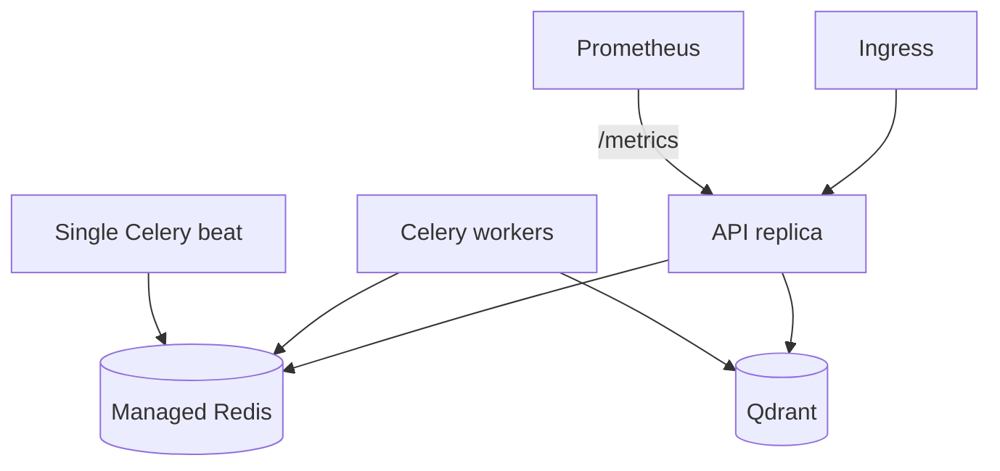

# Operations

This is the canonical deployment, configuration, observability, reliability,
and incident-response guide. Cortex has not been operated in production; the
objectives and manifests below are pre-production controls that require
validation in the target environment.

## Configuration authority

[`src/cortex/config.py`](../src/cortex/config.py) is authoritative for runtime
settings, defaults, parsing, and validation. [`.env.example`](../.env.example)
is the annotated operator-facing list. If they disagree, fix the example
rather than relying on it.

Important controls:

| Setting | Default | Operational effect |
|---|---|---|
| `SECRET_KEY` | Ephemeral outside production | JWT signing; production requires a stable key of at least 32 characters |
| `DEFAULT_MODEL`, `FALLBACK_MODEL`, `EMBEDDING_MODEL` | See settings/example | Models used by the runtime router |
| `REDIS_URL`, `QDRANT_URL` | Local endpoints | Shared episodic/cost/task state and vector storage |
| `MAX_COST_PER_RUN_USD` | `2.00` | Checked before model calls |
| `API_RATE_LIMIT_PER_MINUTE` | `60` | Per-process principal bucket |
| `API_MAX_TRACKED_RUNS` | `1000` | Per-process retained-run cap |
| `API_RUN_RETENTION_SECONDS` | `3600` | Finished-run retention |
| `METRICS_TOKEN` | Unset | Bearer protection for `/metrics`; unset is public |
| `CODE_EXECUTION_ENABLED` | `false` | Enables unsandboxed subprocess execution |
| `MCP_TRANSPORT` | `stdio` | Standalone MCP transport |
| `MCP_HTTP_TOOL_ALLOWLIST` | Four non-code tools | Tools exposed by the authenticated API adapter |
| `HUMAN_REVIEW_BEFORE_CRITIC` | `false` | Suspends before critique; no resume API exists |
| `RAG_MAX_INDEXED_CHUNKS` | `50000` | Per-process sparse index bound |

Runtime settings are the only supported model-routing configuration.

The Colang files under [`config/rails`](../config/rails) are likewise not
mounted in the shipped containers. Local safety checks still run, but the
files are not evidence of active deployed policy.

## Local Docker Compose deployment

```bash
cp .env.example .env
# Set SECRET_KEY and at least one model provider key.
# Compose overrides host-local Redis/Qdrant/Phoenix URLs with service DNS names.
docker compose config
docker compose up -d
docker compose ps
curl http://localhost:8000/health
```

Use `docker compose logs -f cortex-api`, `cortex-worker`, or `cortex-beat` for
component logs. Stop the stack with `docker compose down`. Adding `-v` also
deletes local Redis, Qdrant, Prometheus, and Grafana data volumes.

The Compose stack is a development topology: single Redis and Qdrant
instances, development credentials, public local UI ports, and no backup
policy.

## Kubernetes starting point

The manifests under [`deploy/k8s`](../deploy/k8s) are parsed and checked by
[`tests/test_deploy`](../tests/test_deploy), but have never been applied to a
cluster by this project. Review image references, secrets, ingress, storage,
network policy, probes, and provider endpoints before use.

```bash
kubectl apply -f deploy/k8s/service.yaml

kubectl create secret generic cortex-secrets \
  --namespace cortex \
  --from-literal=SECRET_KEY="$(openssl rand -hex 32)" \
  --from-literal=OPENAI_API_KEY="replace-me" \
  --dry-run=client -o yaml | kubectl apply -f -

kubectl apply -f deploy/k8s/deployment.yaml
kubectl rollout status deployment/cortex-api -n cortex
kubectl get pods,svc,ingress -n cortex
```

The API manifest deliberately fixes the API at one replica and one worker;
workers have a static replica count; beat remains at one replica and uses a
`Recreate` strategy to prevent overlap during rollout. Run state, checkpoints,
rate limits, and sparse retrieval are process-local, so do not scale the API
until those stores are shared.



The manifest includes an ingress-nginx `server-snippet` intended to deny
external `/metrics`, while pod annotations enable credential-free in-cluster
scraping. It does not set `ingressClassName`; a different controller, disabled
snippet annotations, or changed catch-all routing can expose the endpoint.
Verify the rendered controller configuration in the target cluster. Setting
`METRICS_TOKEN` without replacing annotation scraping with an authenticated
scrape configuration makes metrics unavailable. Treat this as a deployment
design choice, not a toggle.

## Release and rollback

1. Run `make gate` on the exact commit.
2. Build an immutable image tagged with the commit SHA.
3. Apply configuration and secrets independently of the image.
4. Roll out one environment at a time and monitor health, 5xx responses,
   agent failures, latency, spend, and safety signals.
5. Confirm workers and the single beat scheduler are healthy.
6. Roll back to the previous immutable image if control-plane health or
   request-edge indicators regress.

There are no relational schema migrations. Rollback does not restore
process-local runs or checkpoints and may leave newer Qdrant/Redis records in
place. Backward compatibility of those records is not currently versioned.

## Service indicators and objectives

### Current evidence status

Cortex has **no production SLO, error budget, or observed availability
baseline**. The repository provides measurable indicators, CI edge budgets,
and provisional alert thresholds. An operator must establish objectives from
real traffic before treating them as commitments.

| Concern | Indicator | Repository policy | Evidence status |
|---|---|---|---|
| API edge latency | p95/p99 for health, metrics, auth rejection, invalid body, rate limiting | CI budgets in [`perf/benchmark.py`](../perf/benchmark.py) | Reproducible in-process measurement; latest local report in [Performance](PERFORMANCE.md) |
| End-to-end availability | Eligible requests without 5xx or unexpected task failure | No objective defined | Metrics exist; no production baseline |
| Agent reliability | Failed runs / all terminal runs | Alert above 10% for 5 minutes | Provisional alert only |
| Agent latency | p95 run duration | Alert above 120 seconds for 5 minutes | Provider and workload dependent |
| Provider latency | p95 LLM duration | Alert above 15 seconds for 2 minutes | Provider dependent |
| Quality | Versioned evaluation axes | No deployment gate | Harness tested; no validated report |
| Safety | Violations by type | Alert on more than 10 in 5 minutes | Detection signal, not attack prevalence or compliance proof |
| Spend | Increase in LLM cost counter | Alert above $10/hour for 5 minutes; per-run budget enforced separately | Pricing and provider metadata dependent |

Alert rules are in [`obs/alerts.yaml`](../obs/alerts.yaml). They are not SLOs:
several are absolute thresholds without traffic normalization, and no
Alertmanager receiver is configured by this repository.

To establish real SLOs:

1. define eligible traffic and planned exclusions;
2. collect at least one representative operating period;
3. segment by endpoint, model, tenant class, and workload where cardinality is
   safe;
4. choose objectives and error-budget windows from observed behavior and user
   impact;
5. configure paging only for actionable symptoms; and
6. version the decision and its evidence.

## Observability

### Metrics

[`src/cortex/obs/metrics.py`](../src/cortex/obs/metrics.py) exposes Prometheus
series for API requests, LLM latency/tokens/cost/errors/cache, agent
runs/duration/tasks/iterations, critic scores/rejections, RAG, memory,
rate-limit rejections, and safety violations.

Prometheus configuration and rule loading are in
[`obs/prometheus.yml`](../obs/prometheus.yml). The Grafana dashboard is
[`obs/grafana/dashboards/cortex.json`](../obs/grafana/dashboards/cortex.json).
Prometheus retains 30 days in Compose; this is not a backup.

### Traces

[`src/cortex/obs/tracing.py`](../src/cortex/obs/tracing.py) emits OpenTelemetry
spans for decorated agent and tool steps. Its safe-capture policy excludes
prompt, messages, content, query, token, and secret arguments. Confirm exporter
reachability with `OTEL_EXPORTER_ENDPOINT`; Phoenix is available in Compose.

### Logs

[`src/cortex/logging_config.py`](../src/cortex/logging_config.py) configures
structured logs to stdout. Preserve `run_id`, component, event, status, model,
and latency fields in the log platform. Do not enable prompt or tool-result
logging without a separate data-handling review.

## Performance

`make perf` runs a multi-round, in-process ASGI gate for stable request-edge
paths. `make perf-report` regenerates [Performance](PERFORMANCE.md). It
deliberately excludes model-backed agent runs.

The Locust profile in [`perf/locustfile.py`](../perf/locustfile.py) targets a
deployed instance and defines provisional p95/p99 and error-rate budgets:

```bash
locust -f perf/locustfile.py --host http://localhost:8000
```

It has not been run against a production deployment. Record the image SHA,
configuration, model/provider behavior, data set, client count, duration, and
infrastructure before treating a run as evidence.

## Runbooks

### API unavailable or elevated 5xx

1. Check `/health`, pod/process status, and recent rollout events.
2. Separate edge failures from background run failures.
3. Inspect structured exceptions and dependency connection errors.
4. Verify Redis and Qdrant reachability from the affected process.
5. Roll back the image/config change if failures align with a deployment.
6. Preserve logs, metrics, trace IDs, image SHA, and configuration revision.

### Runs remain pending or disappear

1. Check for a restart or TTL/LRU eviction.
2. Confirm the background task reached `_execute_run`.
3. Treat lost state as unrecoverable; the run store and checkpointer are not
   durable.
4. Implement a shared run store before scaling or relying on run polling
   operationally.

### High agent failure or latency

1. Split failures by graph step, exception type, and model.
2. Check provider health, retry/fallback events, and cost-budget exceptions.
3. Inspect task/iteration histograms for planner or critic loops.
4. Compare retrieval and memory dependency latency.
5. Disable a degraded provider or roll back prompt/model configuration.

### Unexpected spend

1. Verify the rate of `cortex_llm_cost_usd_total` by model.
2. Inspect per-run Redis summaries and iteration/task counts.
3. Check cache-hit behavior and cache scope.
4. Lower `MAX_COST_PER_RUN_USD` or stop traffic if the ledger is trustworthy.
5. Reconcile provider billing separately; Redis cost data is not durable
   accounting.

### Safety violation spike

1. Identify the violation type and affected authenticated principals.
2. Preserve sanitized request metadata and trace IDs, not raw sensitive text.
3. Rate-limit or block at the ingress/API boundary where justified.
4. Verify the signal against false positives and run safety regression cases.
5. Follow the [Threat model](THREAT_MODEL.md) for containment and residual
   risks.

### Dashboards or alerts are blank

1. Query `/metrics` directly from the Prometheus network.
2. If `METRICS_TOKEN` is set, confirm the scrape sends the bearer token.
3. Check rule-file mounts and Prometheus target/rule status.
4. Verify Grafana's provisioned data source.
5. Confirm an Alertmanager receiver exists; rule evaluation alone sends
   nothing.

### Evaluation regression

Follow the reproducibility and triage process in
[Evaluation](EVALUATION.md#interpreting-a-regression). Do not lower thresholds
until evaluator path, model, corpus, and configuration are matched.

## Incident response

1. **Detect and classify:** customer impact, confidentiality/integrity risk,
   spend exposure, or evaluation-only failure.
2. **Contain:** stop affected traffic, disable code execution, rotate exposed
   credentials, or isolate a provider/store as appropriate.
3. **Preserve evidence:** timestamps, sanitized logs, metrics, traces, image
   digest, configuration revision, and operator actions.
4. **Recover:** roll back, restart, or restore external stores using the
   operator's provider-specific process.
5. **Review:** document cause, missed detection, user impact, and durable
   actions; add regression tests and update the canonical docs.

This repository does not ship backup/restore automation, an on-call schedule,
an incident ticket system, or paging destinations. Those remain deployment
owner responsibilities.
